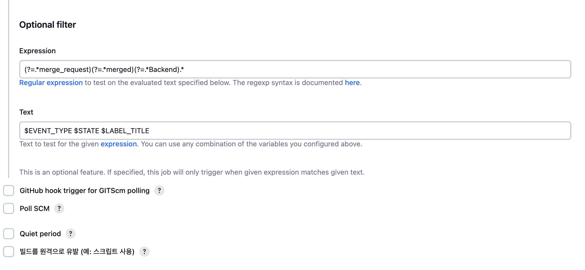

# Blockhomes 포팅 매뉴얼

> 분산 원장 (Distributed Ledger Technology) 기반 부동산 거래 BApp 블록홈즈의 포팅 매뉴얼입니다.

## 목차

1. [개발 환경](#1-개발-환경)
2. [개발 도구](#2-개발-도구)
3. [환경 변수](#3-환경-변수)
4. [CI/CD 파이프라인](#4-cicd-파이프라인)
5. [빌드 및 실행](#5-빌드-및-실행)

## 1. 개발 환경

### Frontend

|      Domain       | Version |
| :---------------: | :-----: |
|       React       | 18.2.0  |
|      Node.js      | 20.10.0 |
|        NPM        | 10.2.3  |
| Styled Components |  6.1.8  |
|    React Query    | 5.35.1  |
|       jotai       |  2.8.0  |
|       Vite        |  5.1.4  |
|     Three.js      | 0.164.1 |
|     Ethers.js     |  5.7.2  |
|      Sock.js      |  1.6.1  |

### Backend

|     Domain      | Version |
| :-------------: | :-----: |
|      Java       |   17    |
|   Spring Boot   |  3.2.5  |
| Spring Data JPA |  3.2.x  |
|    Querydsl     |  5.0.0  |
|      MySQL      |  8.4.0  |
|    RabbitMQ     | 3.13.2  |
|     Gradle      |   8.7   |

### Blockchain

|         Domain         | Version |
| :--------------------: | :-----: |
|        Solidity        |  0.8.x  |
|       truffle.js       | 2.1.15  |
|        Remix.js        | 0.48.0  |
| @openzepplin/contracts |  5.0.2  |
|        caver.js        | 1.11.0  |

### DevOps

#### AWS Instance

> AWS EC2 Ubuntu 20.04.6 LTS (GNU/Linux 5.15.0-1055-aws x86-64)

|  Domain   | Version |
| :-------: | :-----: |
|  Docker   | 26.0.2  |
|   NGINX   | 1.18.0  |
|  Jenkins  | 2.4.55  |
| Sonarqube | 10.3.0  |
|  AWS S3   |    -    |

## 2. 개발 도구

|       Domain       | Version  |
| :----------------: | :------: |
|   IntelliJ IDEA    | 2023.3.2 |
| Visual Studio Code |  1.89.1  |
|      WebStorm      |  2024.1  |

## 3. 환경 변수

1. application.yml

```yml
spring:
  application:
    name: tradings
  config:
    import:
      - classpath:/keys.yml # 키 별도 저장 파일
  jpa:
    hibernate:
      ddl-auto: update
  datasource:
    driver-class-name: com.mysql.cj.jdbc.Driver
    url: jdbc:mysql://${db.host:localhost:3306}/block-homes-dev?serverTimezone=UTC&useUnicode=true&characterEncoding=utf8
    username: ${db.username}
    password: ${db.password}
  servlet:
    multipart:
      max-file-size: 100MB
      max-request-size: 100MB

server:
  port: 8081

logging:
  level:
    org:
      hibernate:
        SQL: debug

springdoc:
  packages-to-scan: com.blockhomes.tradings.controller
  default-consumes-media-type: application/json;charset=UTF-8
  default-produces-media-type: application/json;charset=UTF-8
  swagger-ui:
    path: /
    disable-swagger-default-url: true
    display-request-duration: true
    operations-sorter: alpha
```

2. keys.yml

```yml
# DB 관련 설정
db:
  host: MySQL 호스트 링크 + 포트
  username: MySQL 계정
  password: MySQL 계정 비밀번호

# AWS S3 관련 설정
cloud:
  aws:
    credentials:
      access-key: AWS IAM 액세스 키
      secret-key: AWS IAM 시크릿 키
    region:
      static: S3 지역 명
    stack:
      auto: Stack auto 여부
    s3:
      bucket: S3 버킷 명

# RabbitMQ 관련 설정
spring:
  rabbitmq:
    username: RabbitMQ 계정
    password: RabbitMQ 비밀번호
    host: RabbitMQ 호스트
    port: RabbitMQ 포트 (AMQP Default : 5672, STOMP Default : 61613)
    virtual-host: RabbitMQ Virtual Host 경로
```

### 서비스 포트

|       Domain        |                          Version                           |
| :-----------------: | :--------------------------------------------------------: |
|       Jenkins       |                      8080<br />50000                       |
| Blockhomes-Frontend |                            8090                            |
| Blockhomes-Backend  |                            8081                            |
|        MySQL        |                           33060                            |
|      RabbitMQ       | 5672 (AMQP)<br />15672 (Management Web)<br />61613 (STOMP) |
|        MySQL        |                           33060                            |
|      Sonarqube      |                            9000                            |

## 4. CI/CD 파이프라인

### 1. EC2 서버 접속

```sh
$ ssh -i (K10C203.pem 키 파일 경로)/K10C203.pem ubuntu@k10c203.p.ssafy.io
```

ssh 프로토콜을 활용해 EC2 서버에 접속합니다.

```sh
$ chmod 600 (K10C203.pem 키 파일 경로)/K10C203.pem
```

Permission 오류가 발생한다면, 해당 pem 키 파일의 권한을 높입니다.

### 2. Docker

Ubuntu 운영체제에 맞는 Docker 설치  
공식 홈페이지 참고 (https://docs.docker.com/engine/install/ubuntu/)

### 3. Jenkins

```sh
$ sudo docker pull jenkins:jdk17
$ sudo docker run --name jenkins -d
>    -p 8080:8080 -p 50000:50000
>    -v /var/run/docker.sock:/var/run/docker.sock
>    -v /home/ubuntu/jenkins-data:/var/jenkins_home
>    -u root
>    jenkins/jenkins:jdk17
```

docker를 활용하여 Jenkins 이미지를 pull 받아, 해당 명령어로 Jenkins 컨테이너 실행  
이후 8080 포트로 접속해, CI/CD 파이프라인 생성

```sh
$ sudo docker exec -itu 0 jenkins /bin/bash

curl -fsSL https://download.docker.com/linux/ubuntu/gpg | gpg --dearmor -o /etc/apt/keyrings/docker.gpg
chmod a+r /etc/apt/keyrings/docker.gpg

echo \
  "deb [arch=$(dpkg --print-architecture) signed-by=/etc/apt/keyrings/docker.gpg] https://download.docker.com/linux/ubuntu \
  $(. /etc/os-release && echo "$VERSION_CODENAME") stable" | \
tee /etc/apt/sources.list.d/docker.list > /dev/null

 for pkg in docker.io docker-doc docker-compose docker-compose-v2 podman-docker containerd runc; do  apt-get remove $pkg; done
```

exec 명령어를 활용하여 컨테이너 내부로 진입하여 docker 설치



```
EVENT_TYPE = $.event_type
LABEL_TITLE = $.object_attributes.labels[0].title
STATE = $.object_attributes.state
```

이후 Generic Webhook Trigger 플러그인을 활용해, Merge request event가 발생할 시 Webhook을 보내 지정한 Label이 선택되었다면 빌드하게 설정

```sh
$ sudo docker exec -itu 0 jenkins /bin/bash
$ ssh-keygen
```

가상화 컨테이너이기 때문에 배포 서버 위에서 돌아가고 있다고 하더라도 ssh 프로토콜을 이용하여 배포 서버에 접근하여야 하므로, ssh 키 페어 생성 후 해당 키 페어를 배포 서버에 등록  
(Google 검색 참조)

---

필요 시 Credentials를 등록하여 파이프라인에서 활용 가능 (Dockerhub 토큰, Backend 키 파일 등)

### Jenkinsfile

GitLab Repository의 Frontend, Backend 폴더 밑에 Jenkinsfile을 위치시켜 배포 시 해당 파일을 수행하게 함

#### Frontend

```groovy
pipeline {
  agent any // 어떤 노드에서도 실행 가능

  environment {
    AWS_PUBLIC_IP = '3.34.135.180'
    SSH_CMD = 'ssh -i /var/jenkins_home/.ssh/id_rsa ubuntu@k10c203.p.ssafy.io -o StrictHostKeyChecking=no' // SSH 명령어 설정
    DOCKER = 'sudo DOCKER_BUILDKIT=1 docker' // Docker BuildKit을 활성화하여 docker 명령어 설정
    repository = "sejinnnnnn/blockhomes-frontend" // Docker Hub ID와 Repository 이름
    repo_name = "blockhomes-frontend"
    DOCKERHUB_CREDENTIALS = credentials('dockerhub-token') // Jenkins에 등록된 Docker Hub 인증 정보
    dockerImage = '' // 빌드된 도커 이미지를 저장할 변수
    REPO = "s10-final/S10P31C203"
  }

  stages {

    stage('Install') {
      steps {
        dir('./frontend') {
          script {
            sh 'cp /home/wallet-private-key/GovernmentPrivateKey.ts ./src/constants/abi'
            sh 'npm install' // npm 패키지 설치
            sh 'npm run build' // 프론트엔드 빌드 실행
          }
        }
      }
    }

    stage('Build image') {
      steps {
        script {
          dir('./frontend') {
            dockerImage = docker.build repository // 도커 이미지 빌드
          }
        }
      }
    }

    stage('Login') {
      steps {
        sh 'echo $DOCKERHUB_CREDENTIALS_PSW | docker login -u $DOCKERHUB_CREDENTIALS_USR --password-stdin' // docker hub 로그인
      }
    }

    stage('Push image') {
      steps {
        script {
          sh 'docker push $repository' // 빌드된 도커 이미지를 Docker Hub에 푸시
        }
      }
    }

    stage('Clean image') {
      steps {
        sh 'docker rmi $repository' // Jenkins 컨테이너에서 도커 이미지 제거
      }
    }


    stage('Deployment') {
      steps {
        script {
          try {
            sh '$SSH_CMD $DOCKER stop $repo_name' // 기존에 실행 중인 컨테이너 정지
            sh '$SSH_CMD $DOCKER rm $repo_name' // 컨테이너 제거
            sh "${SSH_CMD} ${DOCKER} rmi \$(docker images | awk '\$1 ~ /${repo_name}/ {print \$3}')" // 기존에 있는 동일한 이름의 image 제거
            sh '$SSH_CMD $DOCKER pull $repository:latest' // 최신 도커 이미지 다운로드
            sh '$SSH_CMD $DOCKER run --name $repo_name -d -p 8090:3000 $repository:latest' // 새 컨테이너 실행
          } catch (e) {
            echo "Deployment failed with error: ${e.getMessage()}" // 배포 실패 시 에러 메시지 출력
          }
        }
      }
    }
  }

  post {
    success {
      script {
        def Author_ID = sh(script: "git show -s --pretty=%an", returnStdout: true).trim() // Git 커밋 작성자 ID 추출
        def Author_Name = sh(script: "git show -s --pretty=%ae", returnStdout: true).trim() // Git 커밋 작성자 이메일 추출
        mattermostSend (color: 'good',
        message: "빌드 성공: ${env.JOB_NAME} #${env.BUILD_NUMBER} by ${Author_ID}(${Author_Name})\n(<${env.BUILD_URL}|Details>)",
        endpoint: 'Mattermost Webhook URL',
        channel: 'Mattermost Channel name'
        ) // 빌드 성공 시 Mattermost에 메시지 전송
      }
    }

    failure {
      script {
        def Author_ID = sh(script: "git show -s --pretty=%an", returnStdout: true).trim() // Git 커밋 작성자 ID 추출
        def Author_Name = sh(script: "git show -s --pretty=%ae", returnStdout: true).trim() // Git 커밋 작성자 이메일 추출
        mattermostSend (color: 'danger',
        message: "빌드 실패: ${env.JOB_NAME} #${env.BUILD_NUMBER} by ${Author_ID}(${Author_Name})\n(<${env.BUILD_URL}|Details>)",
        endpoint: 'Mattermost Webhook URL',
        channel: 'Mattermost Channel name'
        ) // 빌드 실패 시 Mattermost에 메시지 전송
      }
    }
  }
}


```

1. Jenkins 컨테이너 내에서 npm build
2. docker Image 빌드
3. Dockerhub에 해당 이미지 push
4. push가 끝났으므로, 빌드했던 이미지를 삭제
5. ssh로 배포 서버에 접속하여 Dockerhub에서 빌드했던 Image를 pull
6. docker container 실행
7. Mattermost로 빌드 결과 메시징

#### Backend

```groovy
pipeline {
  agent any

  environment {
    AWS_PUBLIC_IP = '3.34.135.180'
    SSH_CMD = 'ssh -i /var/jenkins_home/.ssh/id_rsa ubuntu@k10c203.p.ssafy.io -o StrictHostKeyChecking=no' // SSH 명령어 설정
    DOCKER = 'sudo DOCKER_BUILDKIT=1 docker' // Docker BuildKit을 활성화하여 docker 명령어 설정
    repository = "sejinnnnnn/blockhomes-backend" // Docker Hub ID와 Repository 이름
    repo_name = "blockhomes-backend"
    DOCKERHUB_CREDENTIALS = credentials('dockerhub-token') // Jenkins에 등록된 Docker Hub 인증 정보
    dockerImage = '' // 빌드된 도커 이미지를 저장할 변수
    REPO = "s10-final/S10P31C203"
  }


  stages {

    stage('Add Env Files') {
      steps {
        dir('./backend/tradings') {
          sh 'chmod -R 700 src/main/resources'

          withCredentials([file(credentialsId: 'trading-keys', variable: 'keys')]) {
            sh 'cp ${keys} src/main/resources/keys.yml'
          }
        }
      }
    }

    stage('Build') {
      steps {
        dir('./backend/tradings') {
          script {
            sh "chmod +x ./gradlew"
            sh './gradlew clean build'
          }
        }
      }
    }

    stage('Build image') {
      steps {
        script {
          dir('./backend/tradings') {
            dockerImage = docker.build repository
          }
        }
      }
    }

    stage('Login') {
      steps {
        sh 'echo $DOCKERHUB_CREDENTIALS_PSW | docker login -u $DOCKERHUB_CREDENTIALS_USR --password-stdin' // docker hub 로그인
      }
    }

    stage('Push image') {
      steps {
        script {
          sh 'docker push $repository' //docker push
        }
      }
    }

    stage('Clean image') {
      steps {
        sh 'docker rmi $repository' // jenkins 컨테이너에 있는 docker image 제거
      }
    }

    stage('Deployment') {
      steps {
        script {
          try {
            sh '$SSH_CMD $DOCKER stop $repo_name'
            sh '$SSH_CMD $DOCKER rm $repo_name'
            sh "${SSH_CMD} ${DOCKER} rmi \$(docker images | awk '\$1 ~ /${repo_name}/ {print \$3}')"
          } catch (e) {
            sh 'echo "fail to stop and remove container"'
          }
        }
        sh '$SSH_CMD $DOCKER pull $repository:latest'
        sh """$SSH_CMD $DOCKER run --name $repo_name -d -p 8081:8081 $repository -e TZ=Asia/Seoul"""
        //         sh '$SSH_CMD $DOCKER compose up'
      }
    }

}

post {
  success {
    script {
      def Author_ID = sh(script: "git show -s --pretty=%an", returnStdout: true).trim()
      def Author_Name = sh(script: "git show -s --pretty=%ae", returnStdout: true).trim()
      mattermostSend (color: 'good',
        message: "빌드 성공: ${env.JOB_NAME} #${env.BUILD_NUMBER} by ${Author_ID}(${Author_Name})\n(<${env.BUILD_URL}|Details>)",
        endpoint: 'Mattermost Webhook URL',
        channel: 'Mattermost Channel name'
      )
    }
  }

  failure {
      script {
        def Author_ID = sh(script: "git show -s --pretty=%an", returnStdout: true).trim()
        def Author_Name = sh(script: "git show -s --pretty=%ae", returnStdout: true).trim()
        mattermostSend (color: 'danger',
          message: "빌드 실패: ${env.JOB_NAME} #${env.BUILD_NUMBER} by ${Author_ID}(${Author_Name})\n(<${env.BUILD_URL}|Details>)",
          endpoint: 'Mattermost Webhook URL',
          channel: 'Mattermost Channel name'
        )
      }
    }
  }

}

```

1. GitLab에 올라가지 않는 Key 모음 파일을 프로젝트 경로에 복사
2. Jenkins 컨테이너 내에서 gradle을 활용하여 프로젝트 빌드
3. docker Image 빌드
4. Dockerhub에 해당 이미지 push
5. push가 끝났으므로, 빌드했던 이미지를 삭제
6. ssh로 배포 서버에 접속하여 Dockerhub에서 빌드했던 Image를 pull
7. docker container 실행
8. Mattermost로 빌드 결과 메시징

### 4. Nginx

```sh
$ sudo apt-get update
$ sudo apt-get install nginx -y
$ sudo apt-get install letsencrypt
$ sudo apt-get install certbot python3-certbot-nginx
```

Nginx와 SSL 인증서 발급 관련 패키지 설치

- /etc/nginx/site-avaliable/block-homes.conf

```conf
server {
    listen 80 default_server;
    listen [::]:80 default_server;

    server_name block-homes.kr;

    return 301 https://$server_name$request_uri;
}

server {
    listen 443 ssl;

    server_name block-homes.kr;

    client_max_body_size 100M;

    ssl_certificate /etc/letsencrypt/live/block-homes.kr/fullchain.pem; # managed by Certbot
    ssl_certificate_key /etc/letsencrypt/live/block-homes.kr/privkey.pem; # managed by Certbot

    location / {
        proxy_pass http://localhost:8090;

        proxy_set_header Upgrade $http_upgrade;
        proxy_set_header Connection "upgrade";

    }

}

server {
    listen 80;
    listen [::]:80;

    server_name k10c203.p.ssafy.io;

    return 301 https://$server_name$request_uri;
}


server {
    listen 443 ssl;

    server_name k10c203.p.ssafy.io;

    client_max_body_size 100M;

    ssl_certificate /etc/letsencrypt/live/k10c203.p.ssafy.io/fullchain.pem; # managed by Certbot
    ssl_certificate_key /etc/letsencrypt/live/k10c203.p.ssafy.io/privkey.pem; # managed by Certbot

    location / {
        proxy_pass http://localhost:8081;

        proxy_set_header Upgrade $http_upgrade;
        proxy_set_header Connection "upgrade";
    }

    location /ws/chat {
        proxy_pass http://localhost:8081;

        proxy_set_header Upgrade $http_upgrade;
        proxy_set_header Connection "upgrade";
    }

}
```

해당 conf 파일을 통해 도메인 지정 및 경로에 따른 분기 처리를 할 수 있다.

```sh
$ sudo ln -s /etc/nginx/sites-avaliable/block-homes.conf /etc/nginx/sites-enabled/block-homes.conf
$ nginx -t # nginx 설정 파일 구문 오류 체크
$ sudo systemctl restart nginx # 설정 적용을 위한 재시작
```

Nginx 설정을 적용하기 위해 심볼릭 링크를 생성하고 테스트 후, Nginx를 재시작한다.

## 5. 빌드 및 실행

### Backend

- `https://k10c203.p.ssafy.io/api` : API 서버 URL
- `https://k10c203.p.ssafy.io/swagger-ui/index.html` : API 명세 docs (Swagger-ui)
- `ws://k10c203.p.ssafy.io/` : WebSocket URL

### Frontend

`https://block-homes.kr` : Frontend URL

### Blockchain

> Klaytn 테스트넷인 Baobab Network에 실제 배포되어 있습니다.

|              Contract 배포 주소              |          설명           |                                                    링크                                                    |
| :------------------------------------------: | :---------------------: | :--------------------------------------------------------------------------------------------------------: |
| `0x92e56Bbc4f4e05B6cC62d44c320E3BD020FDFAda` |   사용자 DID Registry   | [Link](https://baobab.klaytnscope.com/account/0x92e56Bbc4f4e05B6cC62d44c320E3BD020FDFAda?tabId=internalTx) |
| `0x9329387107fBb6b933778eC2c136FB112B5134c3` |    신원 VC Registry     |   [Link](https://baobab.klaytnscope.com/account/0x9329387107fBb6b933778eC2c136FB112B5134c3?tabId=txList)   |
| `0xF52f87387272E75c372c193aB0d598cD44324b88` |   부동산 DID Registry   |   [Link](https://baobab.klaytnscope.com/account/0xF52f87387272E75c372c193aB0d598cD44324b88?tabId=txList)   |
| `0x9AAD87B5D7b5C64CFE694F48E2B1652442117294` | 부동산 소유 VC Registry |   [Link](https://baobab.klaytnscope.com/account/0x9AAD87B5D7b5C64CFE694F48E2B1652442117294?tabId=txList)   |

### ABI (Application Binary Interface)

Notion 참조 (https://www.notion.so/hyeon-zip/ABI-API-3d0b0f2f7a1148beb4c7611764b032e6)
